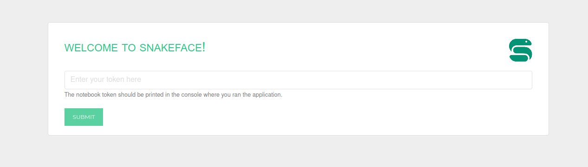
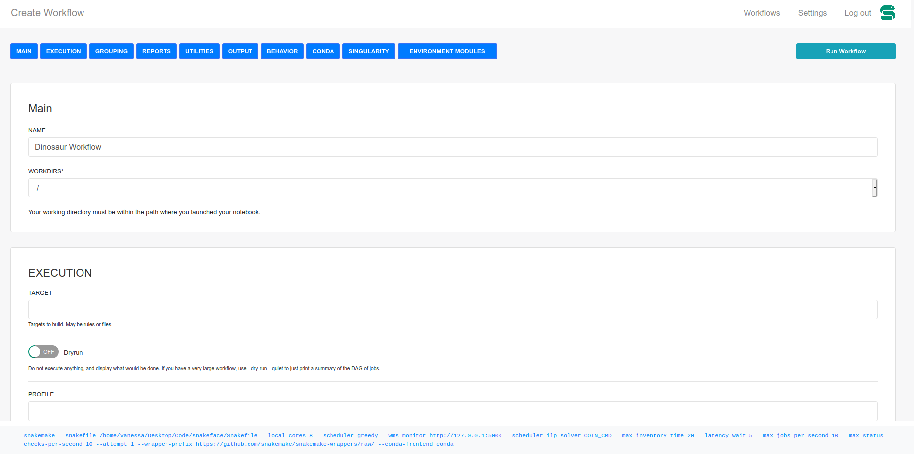

# Snakemake Interface (snakeface)

Snakeface is an interface for snakemake. If you are an individual, you can run
it locally to manage one or more workflows. If you are an institution or group,
you can deploy a shared instance for others to use. To get started, please see
the [documentation](https://readthedocs.github.io/snakeface) (not created yet).

## Usage

This usage will be moved into the (not developed) documentation. To start
a snakeface notebook, you can type:

```bash
snakeface notebook
```

or specify a port:

```bash
snakeface notebook --port 5555
```

and browse to the port specified at localhost to enter a token.



and here is the start of creating a workflow:



**under development**

## Thanks

Snakeface wouldn't be possible without several open source libraries!

 - [Django](https://github.com/django/django) "The web framework for perfectionists" (and dinosaurs) 

## License

 * Free software: MPL 2.0 License

