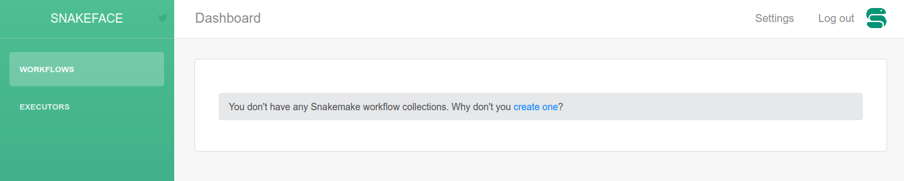
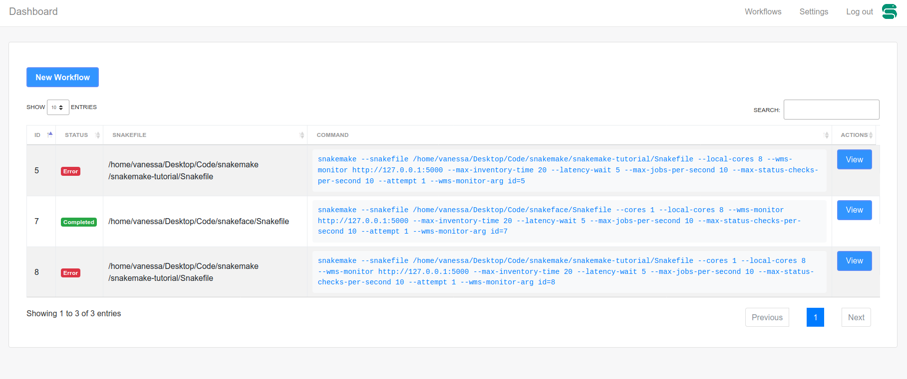

.. _getting_started-notebook:

========
Notebook
========

Make sure that before you run a notebook, you are comfortable with Snakemake
and have a workflow with a Snakefile read to run. If not, you can start
with the instructions for an example workflow (:ref:`getting_started-example-workflow`).

Local Notebook
==============

If you have installed Snakeface on your own, you likely want a notebook. You can
run snakeface without any arguments to run one by default: This works because
the default install settings have set ``NOTEBOOK_ONLY`` and it will start a Snakeface
session.

.. code:: console

    $ snakeface

However, if your center is running Snakeface as a service, you will need to ask for
a notebook explicitly:

.. code:: console

    $ snakeface notebook

For either of the two you can optionally specify a port:

.. code:: console

    $ snakeface notebook --port 5555
    $ snakeface --port 5555

For the notebook install, you will be given a token in your console, and you can copy
paste it into the interface to log in. 

.. image:: ../images/notebook-login.png

You can then browse to localhost at the port specified to see the interface!
The first prompt will ask you to create a collection, which is a grouping of workflows.
You might find it useful to organize your projects.

Next, click on the button to create a new workflow. The next
form will provide input fields for all arguments provided by your Snakemake
installation. You can select the blue buttons at the top (they are always at the
top) to jump to a section, and see the command being previewed at the bottom.
The command will always update when you make a new selection.

.. image:: ../images/new_workflow.png

Note that if you start running your notebook in a location without any Snakefiles,
you will get a message that tells you to create one first. A Snakefile matching
some pattern of snakefile* (case ignored) must be present. When you've finished your
workflow, click on "Run Workflow." If the workflow is invalid (e.g., you've moved the
Snakefile, or provided conflicting commands) then you'll be returned to this
view with an error message. If it's valid, you'll be redirected to a page to monitor
the workflow.

.. image:: ../images/workflow-detail.png

This page also has metadata for how to interact with your workflow if you choose
to run it again with Snakemake from the command line. A token and arguments for monitoring
are required. At the bottom part of the page, there is a status table that updates
automatically via a Web Socket.

.. image:: ../images/workflow-table.png

Finally, you'll also be able to see your workflows on the dashboard page in the Workflows table.

Continuing A Workflow
=====================

If you want to start a workflow from the command line to interact with a snakeface
server, or you've already started one with Snakeface and want it to reference the same identifier again,
you can easily run snakemake to do this by adding an environment variable for an 
authorization token, and a workflow id. If you look at the workflow details page above,
you'll see that the token and command line arguments are provided for you. You
might re-run an existing workflow like this:

.. code:: console

    export WMS_MONITOR_TOKEN=a2d0d2f2-dfa8-4fd6-b98c-f3219a2caa8c
    snakemake --cores 1 --wms-monitor http://127.0.0.1:5000 --wms-monitor-arg id=3

Workflow Reports
================

If you want to add a report file to the workflow, just as you would with command line 
Snakemake, you'll need to install additional dependencies first:

.. code:: console

    pip install snakemake[reports]

And then define your report.html file in the reports field.
    

